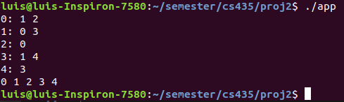
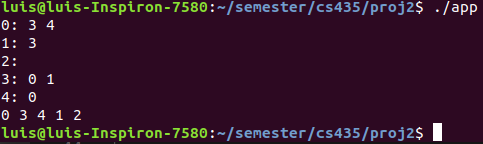
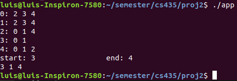
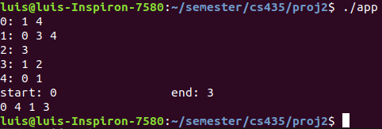
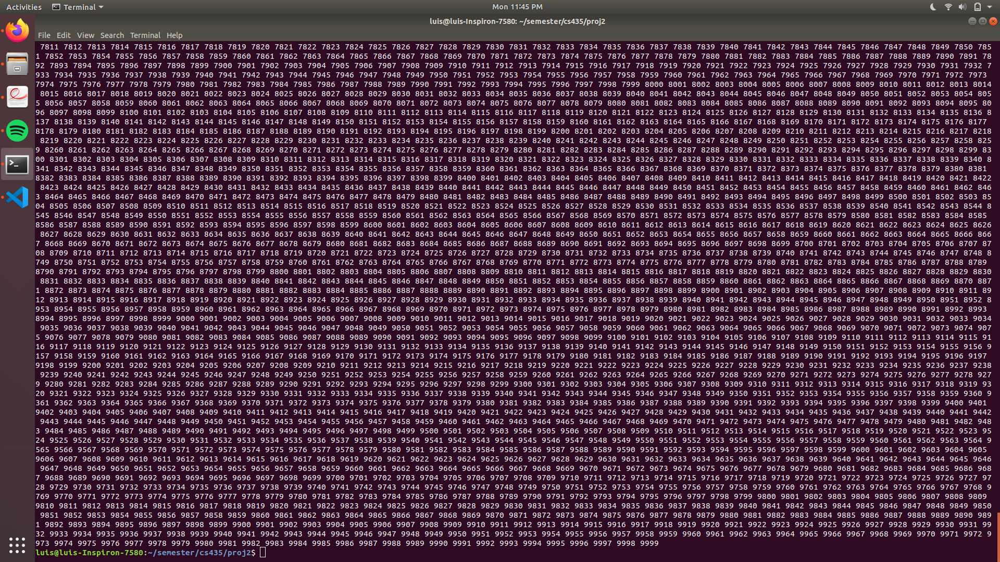

<h1>Project 2</h1>

<h2>Building and Running</h2>

To build the project follow these steps:
 
<ul>
    <li>Clone the project using `git clone https://github.com/lahoising78/cs435-project-2.git`</li>
    <li>In bash, go to the directory where the clone was cloned and type `make1</li>
</ul>

To run the application use `./app`

<h2>Output Samples</h2>
<h4>BFT Iter</h4>

<h4>BFT Rec</h4>

<h4>DFS Iter</h4>

<h4>DFS Rec</h4>

<h4>BFT List Rec</h4>

<h4>BFT List Iter</h4>
